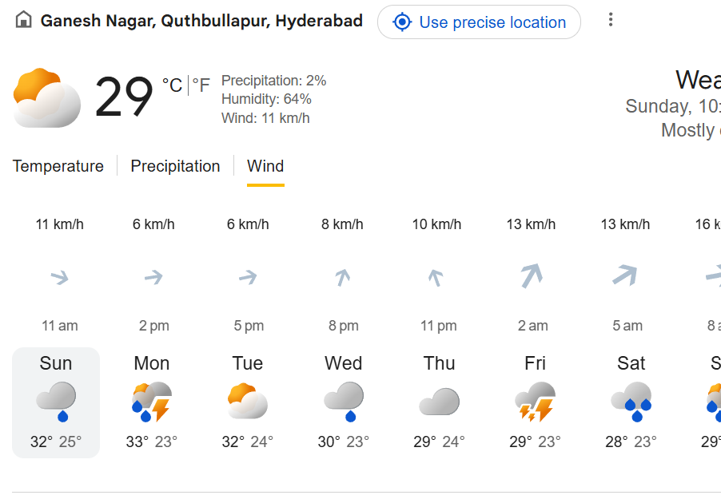

# Skyline Weather Forecast Dashboard



A premium, interactive weather dashboard built in **React.js** and **Vite**, styled to match the exact aesthetics, layout, and behaviors of the **Google Search Weather** interface.

---

## 🌟 Key Features

### 📍 Precise India Search & Suggestions
- Autocomplete geocoding search suggestions **filtered exclusively to India** (country code `IN`).
- Fully supports searches for neighborhoods, towns, and cities across the country.

### 🕒 Timezone-Aware ticking clock
- Dynamic digital header clock displaying the ticking local time and formatted date (weekday, month, date) adjusted automatically to the searched city's native timezone.

### 🌡️ Current Conditions & Apparent Temperature
- Large weather header highlighting active temperature units (°C / °F toggle).
- Integrated **Feels-Like** apparent temperature alongside real-time humidity, wind speed, and precipitation levels.
- Horizontal hourly scrolling tabs for Temperature graph, Precipitation probability, and dynamic rotating wind vector arrows.

### 📊 7-Day Forecast Cards
- Horizontal forecast deck showing weekdays, condition icons, and daily max/min temperatures.
- Selecting any daily card updates the entire dashboard with that day's statistics and averages.
- Active card highlighted with Google's flat silver/gray card design.

### 🗺️ Interactive Maps (Streets, Satellite, Terrain)
- Integrated custom keyless Leaflet map widget inside both the dashboard and the fullscreen maximized modal.
- Supports instant switches between **Streets** (OSM standard), **Satellite** (Esri World Imagery), and **Terrain** (Esri Topo Map) tile sets.

### ☀️ Air Quality & UV Index (2x2 Metrics Grid)
- **Air Quality (AQI)**: Displays the current US AQI index alongside descriptive status ratings and color safety dots.
- **UV Index**: Daily maximum UV index with risk severity ratings.
- **Sunrise & Sunset**: Daily local sunrise/sunset clock times.

### ⭐ Saved Locations (Favorites)
- Gold star button to save/remove active cities from your **Saved Locations** sidebar, persisted across reloads using `localStorage`.

### 🌓 Clean Dual Theme Layout
- Supports light mode (clean white background and soft grays) and high-contrast dark charcoal slate theme, both toggled seamlessly with a single switch.

---

## 🛠️ Tech Stack & Architecture

- **Core**: React.js 19 + Vite + ES6+
- **Styling**: Vanilla CSS (no Tailwind/Bootstrap) powered by responsive Grid/Flexbox layouts and custom CSS theme variables.
- **Icons**: Lucide React
- **Maps**: Leaflet.js CDN (keyless tile resolution)
- **API Services**:
  - **Open-Meteo Forecast API**: Keyless, free global weather and daily indices.
  - **Open-Meteo Geocoding API**: Coords translation.
  - **OpenStreetMap Nominatim API**: Async reverse-geocoding coordinates to local neighborhood names.
  - **Open-Meteo Air Quality API**: US AQI indices.

---

## 🚀 Quick Start

### 1. Clone & Navigate
```bash
git clone https://github.com/Luhith2005/Weather-Forecast.git
cd Weather-Forecast
```

### 2. Install Dependencies
```bash
npm install
```

### 3. Run Locally
```bash
npm run dev
```
Open **[http://localhost:5173](http://localhost:5173)** in your browser.

### 4. Build Production Bundle
```bash
npm run build
```
The optimized bundle will be compiled to the local `dist/` directory.
